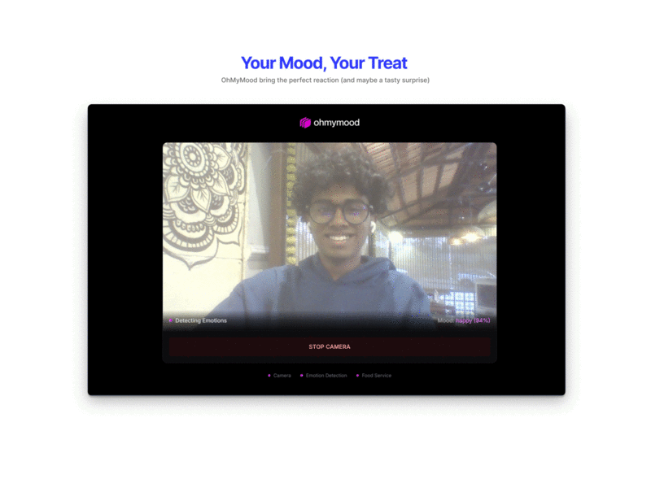
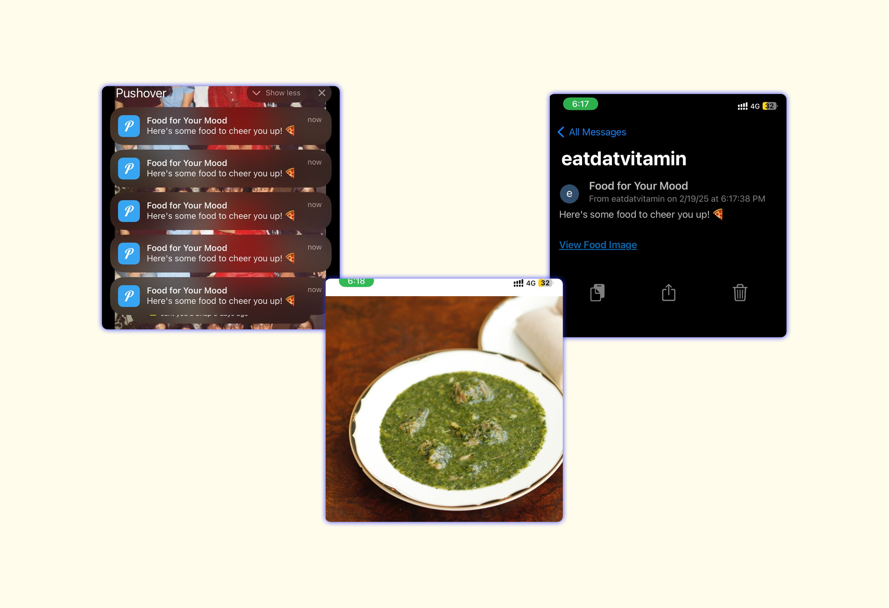

<div align="center">
  
</div>

# if sad send food
> A fun project that sends you food pictures when you're feeling down 🍕

This project uses your webcam to detect if you're sad and sends delicious food pictures to cheer you up! Heavily inspired by [if-sad-send-cat](https://github.com/healeycodes/if-sad-send-cat) by [@healeycodes](https://github.com/healeycodes).

<div align="center">
  
  
  
  
</div>

## how?
- captures your webcam feed through a sleek browser interface
- analyzes emotions using [deepface](https://github.com/serengil/deepface)
- sends food pictures via [pushover](https://pushover.net/) when you're feeling down
- uses [mealdb api](https://www.themealdb.com/api.php) for delicious food images

## screenshots

### emotion detection in action


### food notification


## setup

### backend
```bash
cd backend
pip install -r requirements.txt
python server.py
```

### frontend
```bash
cd frontend
npm install
npm run dev
```

### configuration
create a `.env` file in the backend directory with:
```
PUSHOVER_API_KEY=your_api_key
PUSHOVER_USER_KEY=your_user_key
TF_ENABLE_ONEDNN_OPTS=0
```

## usage
1. go to `http://localhost:3000`
2. allow camera access
3. click "start camera"
4. be sad
5. receive food!

## tech stack
- **frontend**: react, tailwind css, shadcn/ui
- **backend**: fastapi, deepface, python
- **apis**: pushover, mealdb api

## acknowledgments
- huge thanks to [@healeycodes](https://github.com/healeycodes) for the inspiration from [if-sad-send-cat](https://github.com/healeycodes/if-sad-send-cat)
- [deepface](https://github.com/serengil/deepface) for emotion detection
- [themealdb api](https://www.themealdb.com/api.php) for the food images
- [pushover](https://pushover.net/) for notifications

## license
mit